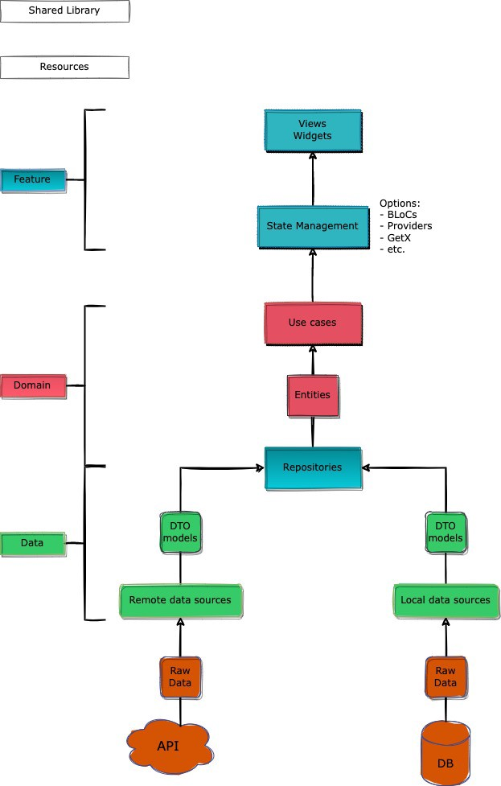

## Modularization Structure 🔥

    # Root Project
    .
    ├── lib                    # Name of module (default from Flutter)
    |   ├── domains            # Name of directory
    |   |   ├── domain A       # Domains module with a data and domains layer inside it.
    |   |   ├── domain B
    |   |   └── domain etc
    |   |
    |   ├── features           # Name of directory
    |   |   ├── feature A      # Feature module with a presentation/ui/feature layer inside it.
    |   |   ├── feature B
    |   |   └── feature etc
    |   |
    |   ├── resources          # Name of directory
    |   |   └── resources      # Handle resources like assets, fonts, constant value, etc.
    |   |
    |   └── shared_libraries   # Name of directory
    |       ├── common         # Handle common utility class.
    |       ├── component      # Handle custom widget.
    |       ├── core           # Core module.
    |       └── dependencies   # Handle dependency injection related stuff.

## Clean Architecture Flow (Feature Module) 🔥
<pre>

</pre>

## Built With 🛠
* [Modularization](https://medium.com/flutter-community/mastering-flutter-modularization-in-several-ways-f5bced19101a) - Separate functionality into independent, interchangeable modules.
* [Clean Architecture](https://medium.com/ruangguru/an-introduction-to-flutter-clean-architecture-ae00154001b0) - The blueprint for a modular system, which strictly follows the design principle called separation of concerns.
* [Dependency Injection (get_it)](https://pub.dev/packages/get_it) - Simple direct Service Locator that allows to decouple the interface from a concrete implementation and to access the concrete implementation from everywhere in your App.
* [State Management (BLoC)](https://bloclibrary.dev/) - Business logic component to separate the business logic with UI.
* [Dio](https://github.com/flutterchina/dio/) - A type-safe HTTP client.

## Step By Step Run This Project
1. **Clone the project**: Use the command `git clone <repository-url>` to clone the project to your local machine.

2. **Navigate to the project directory**: Use the command `cd <project-name>` to navigate into the root directory of the project.

3. **Check Flutter and Dart versions**: Make sure you have the correct versions of Flutter and Dart installed. You can check your versions with `flutter --version` and `dart --version`. If necessary, update your Flutter and Dart SDKs.

4. **Get the dependencies**: Run `flutter pub get` to fetch the project dependencies.

5. **Check for any dependency issues**: Run `flutter doctor` to check for any potential issues with your Flutter installation.

6. **Run the project**: Use the command `flutter run` to start the project. If you have multiple devices connected, use `flutter run -d <device-id>` to specify the device.

## Author

* **Tinh Huynh**

Don't forget to follow me, fork and give me a ⭐
